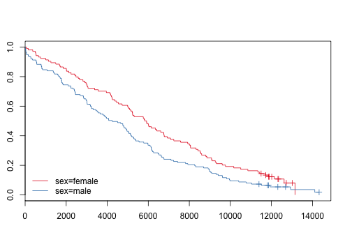
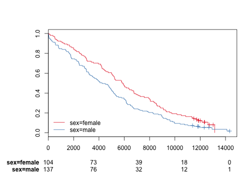
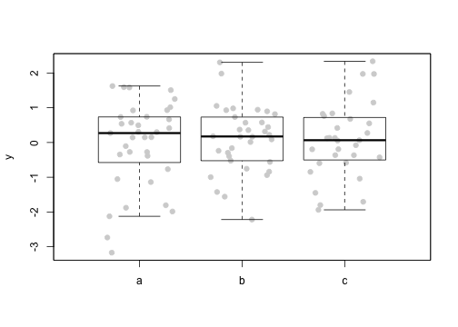
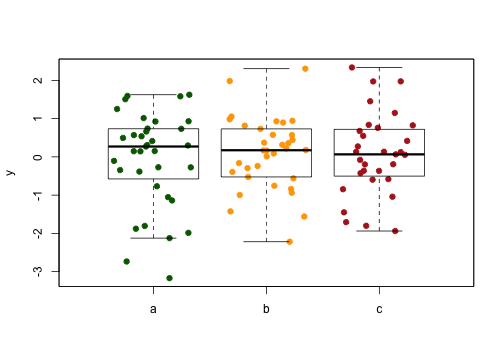
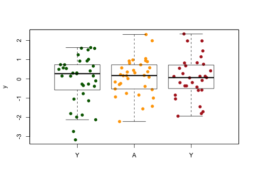
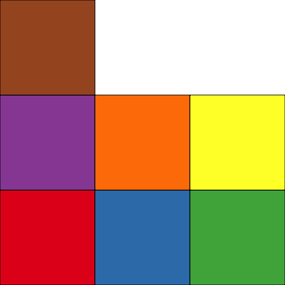
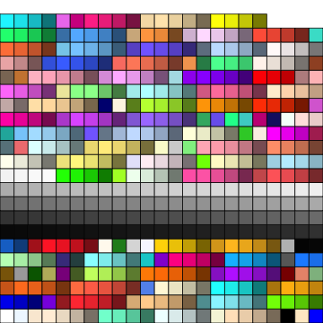

For visualization, I focus on writing functions for plots I use frequently and that require many lines of base R. At present, the package support two plots, `km.plot` and `stripboxplot`.

# Kaplan-Meier Plots – `km.plot`

Kaplan-Meier plots are used for visualizing censored data. They are most commonly used in medical studies for showing how survival differs between treatment groups. Building a KM plot in R is straightforward, but requires several function calls. First you call the `survfit` function from the [survival](https://cran.r-project.org/web/packages/survival/index.html) package, and then call plot on the resulting object.

To speed up this process, I wrote my own wrapper function `km.plot`.


```r
library(hedgehog);
library(survival);

# using example from survival package
km.plot(
    Surv(futime, death) ~ sex, 
    mgus
    );
```




```r
km.plot(
    Surv(futime, death) ~ sex, 
    mgus,
    show.risk.table = TRUE
    );
```



# Box plots – `stipboxplot`

Standard box plots hide the sample size in each group. One way of getting around this is to add a background stripplot that shows each point in the dataset. 


```r
test.data <- data.frame(
    x = sample(letters[1:3], 100, replace = TRUE),
    y = rnorm(100)
    );

stripboxplot(y ~ x, test.data);
```



By default, all background points are grey. We can change this by using the `points.col` argument. It is passed directly to `stripchart`, and thus follows the stripchart convention of assigning colours by grouping variable. 


```r
stripboxplot(
    y ~ x, 
    test.data,
    points.col = c('darkgreen', 'orange', 'firebrick')
    );
```



There are a number of arguments for tweaking the plot appearance. To change the category labels, use the `group.names` argument.


```r
stripboxplot(
    y ~ x, 
    test.data,
    points.col = c('darkgreen', 'orange', 'firebrick'),
    group.names = c('Y', 'A', 'Y')
    );
```



# Colour palettes

The function `get.colour.palette` contains a few pre-made colour palettes. To quickly look at what colours are included in a palette, run `show.colour.palette`.


```r
show.colour.palette( get.colour.palette(7) );
```



The visualization function also works with other colour palettes.


```r
show.colour.palette( colours(7) );
```




